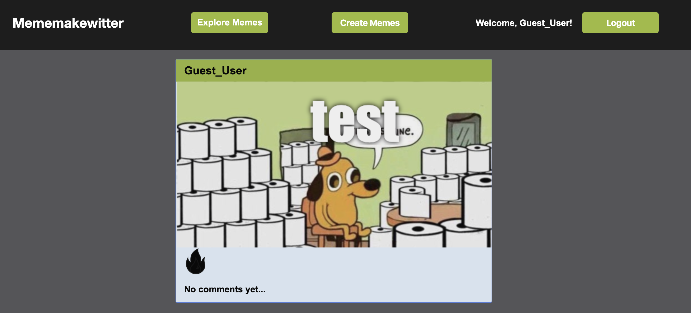

# Mememakewitter

The goal of the project is to create custom memes. Functionality:

* Users can use stock or upload custom pictures to use in the meme
* Users can change the font, size, color of the meme
* Users will be able to view, like, and comment on memes created by other users

See it live: http://supermememaker.herokuapp.com/#/



## List of technologies:

* Front-end:
  - React
  - Redux
  - Axios
  - Html2Canvas

* Back-end:
  - MongoDB
  - Express

## Example:

### Users can see a list of memes that other users have posted.


```javascript
router.get("/", (req, res) => {
    Meme
        .find()
        .limit(6)
        .sort({ date: -1 })
        .populate({path: 'comments',
            populate: {
                path: 'user',
                model: 'User',
                select: 'username'
            }
        })
        .populate('likes', '-password')
        .populate('user', '-password')
        .then(memes => res.json(memes))
        .catch(err => res.status(400).json(err));
})
```

### Users can comment on and like a specific meme.


```javascript
router.post("/:id/like", 
passport.authenticate("jwt", { session: false }),
(req, res) => {
    
    Meme.findByIdAndUpdate(req.id,
        { "$addToSet": { "likes": req.user.id } },
        function (err, meme) {
            if (err) return res.status(500).send("There was a problem creating a like.");
            res.status(200).send("Like was added!");
        }
    );
})
```
### Users can create a custom meme by clicking on "Create memes" button, choose a file and then add upper and/or lower text. User can resize the text.


The function saveFile will take the screenshot of the canvas to create the image with user’s customer texts:

```javascript
saveFile() {
        var self = this;
        var screenshot = document.getElementsByClassName("memeGenerator");
        html2canvas(screenshot[0],{
            imageTimeout: 30000,
            backgroundColor: "null"})
        .then( (canvas) => { 
            const base64image = canvas.toDataURL("image/png");
            let image = { image: base64image };
            self.props.composeMemes(image);
        })
        .then( (res) => this.props.fetchMemes())
        .then(this.props.closeModal)
        
        this.setState({uppertext: ""});
        this.setState({lowertext: ""}); 
    }
```

### Users can explore more memes.


Using an API, we have memes from other websites to be displayed on our page. For ease of use, we have addEventListener on scrolling to request more as users reach the bottom of the page:

```javascript
componentDidMount() {
        this.getMemes();
        window.addEventListener("scroll", (event) => {
           
            let scrollTop = document.body.scrollTop || document.documentElement.scrollTop;
            let scrollHeight = event.srcElement.body.scrollHeight;

            if (scrollTop + window.outerHeight >= scrollHeight) {
                this.setState({ loading: true });
                setTimeout(() => {
                    this.getMemes();
                }, 1500);
            }
        });
    }
```

## Future features:

* Users can follow other users
* Users can add friends

## Creators:

1. [Eric Ho](https://github.com/Trombed)
2. [Jimmy Kang](https://github.com/byfebeef)
3. [Iryna McBride](https://github.com/irynamcb)
4. [Albert Chen](https://github.com/albertchen1)
